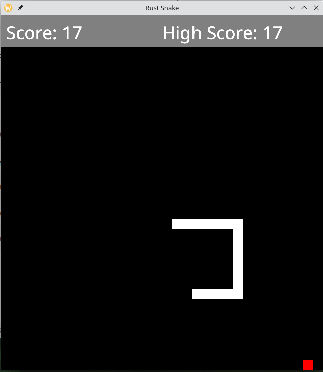

# Snake in Rust
This is a simple snake game written in Rust. It uses the [speedy2d](https://docs.rs/speedy2d/latest/speedy2d/) library for rendering.

## How to play
The snake is controlled with the arrow keys. The goal is to eat as many apples as possible. The snake grows longer with every apple it eats. The game is endless.

## Controls
* Arrow keys: Move the snake
* <kbd>ESC</kbd>: Quit the game
* <kbd>,</Kbd>: Slow down the game
* <kbd>.</kbd>: Speed up the game
* <kbd>R</kbd>: Restart the game
* <kbd>Space</kbd>: Pause the game

## How to build
You need to have Rust installed. Then you can run `cargo build --release` to build the game. The executable will be in `target/release/snake`.

## How to run
You can run the game with `cargo run --release`. You can also run the game with `cargo run --release -- --help` to see all available options.

## Example

## License
Copyright 2023 Jake C Redrupp

Permission is hereby granted, free of charge, to any person obtaining a copy of this software and associated documentation files (the “Software”), to deal in the Software without restriction, including without limitation the rights to use, copy, modify, merge, publish, distribute, sublicense, and/or sell copies of the Software, and to permit persons to whom the Software is furnished to do so, subject to the following conditions:

The above copyright notice and this permission notice shall be included in all copies or substantial portions of the Software.

THE SOFTWARE IS PROVIDED “AS IS”, WITHOUT WARRANTY OF ANY KIND, EXPRESS OR IMPLIED, INCLUDING BUT NOT LIMITED TO THE WARRANTIES OF MERCHANTABILITY, FITNESS FOR A PARTICULAR PURPOSE AND NONINFRINGEMENT. IN NO EVENT SHALL THE AUTHORS OR COPYRIGHT HOLDERS BE LIABLE FOR ANY CLAIM, DAMAGES OR OTHER LIABILITY, WHETHER IN AN ACTION OF CONTRACT, TORT OR OTHERWISE, ARISING FROM, OUT OF OR IN CONNECTION WITH THE SOFTWARE OR THE USE OR OTHER DEALINGS IN THE SOFTWARE.